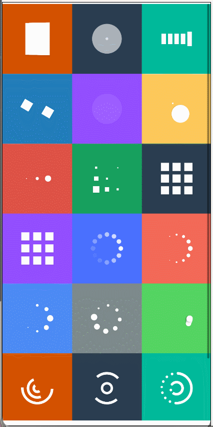

# SpinKit(API12 - 5.0.3.800)

--------------------------------------------------------------------------------

## 🏆简介与推荐

[SpinKit](https://ohpm.openharmony.cn/#/cn/detail/@pura%2Fspinkit)
是一个适用于OpenHarmony/HarmonyOS的加载动画库。

[harmony-utils](https://ohpm.openharmony.cn/#/cn/detail/@pura%2Fharmony-utils)
一款功能丰富且极易上手的HarmonyOS工具库，借助众多实用工具类，致力于助力开发者迅速构建鸿蒙应用。

[harmony-dialog](https://ohpm.openharmony.cn/#/cn/detail/@pura%2Fharmony-dialog)
一款极为简单易用的零侵入弹窗，仅需一行代码即可轻松实现，无论在何处都能够轻松弹出。

## 📚下载安装

`ohpm i @pura/spinkit`

OpenHarmony ohpm  
环境配置等更多内容，请参考[如何安装 OpenHarmony ohpm 包](https://ohpm.openharmony.cn/#/cn/help/downloadandinstall)

## 📚效果图

效果图略有卡顿，请运行源码或添加依赖，查看效果。      


## 📚SpinKit组件

| 属性        | 介绍         |
|:----------|:-----------|
| spinType  | 动画的类型      |
| spinSize  | 动画的大小，默认60 |
| spinColor | 动画的颜色，默认白色 |

 ```
  SpinKit()
  
  SpinKit({ spinType: SpinType.spinA })
  
  SpinKit({ spinType: SpinType.spinH })
  
  SpinKit({
     spinType: SpinType.spinA,
     spinColor: Color.Pink,
     spinSize: 70
  })
 ```

## 加载弹框请移步[harmony-dialog](https://ohpm.openharmony.cn/#/cn/detail/@pura%2Fharmony-dialog)

## 💖沟通与交流🙏

使用过程中发现任何问题都可以提 [Issue](https://gitee.com/tongyuyan/harmony-utils/issues)给我们；   
当然，我们也非常欢迎你给我们发 [PR](https://gitee.com/tongyuyan/harmony-utils/pulls) 。

[https://gitee.com/tongyuyan/harmony-utils](https://gitee.com/tongyuyan/harmony-utils)  
[https://github.com/787107497](https://github.com/787107497)

QQ群：569512366

## 🌏开源协议

本项目基于 [Apache License 2.0](https://www.apache.org/licenses/LICENSE-2.0.html) ，在拷贝和借鉴代码时，请大家务必注明出处。   

